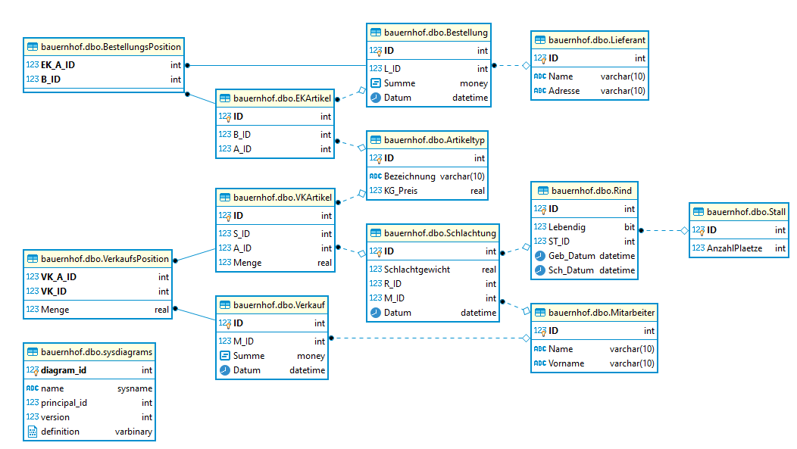

# Bauernhof
Es war einmal ein wunderschöner Bauernhof...\
**NOTE: The scripts are written for Azure SQL Server in T-SQL**

### Steps:
1. connect to database "bauernhof"
2. execute ./scripts/init_database.sql
3. execute ./scripts/init_trigger.sql

### ERM:
